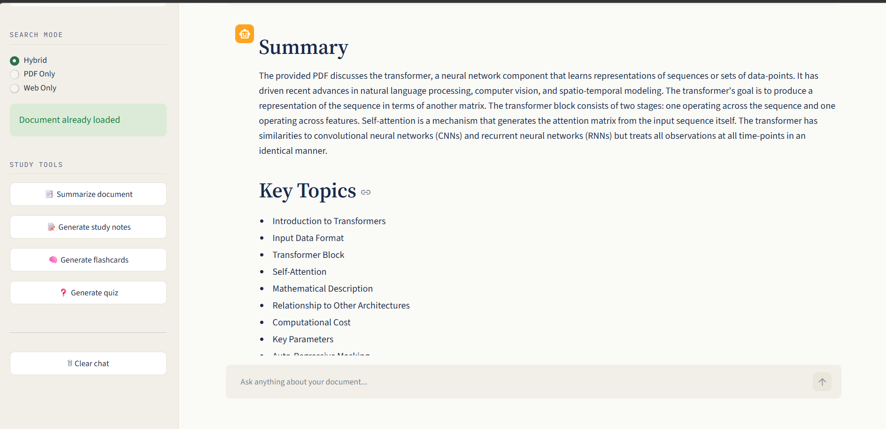
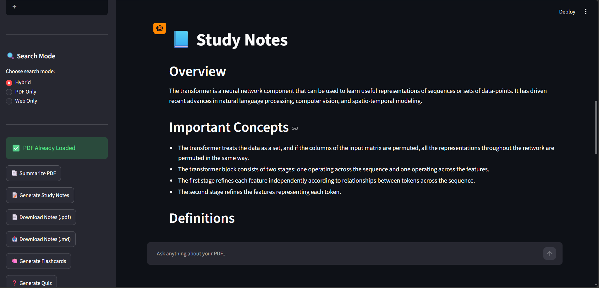
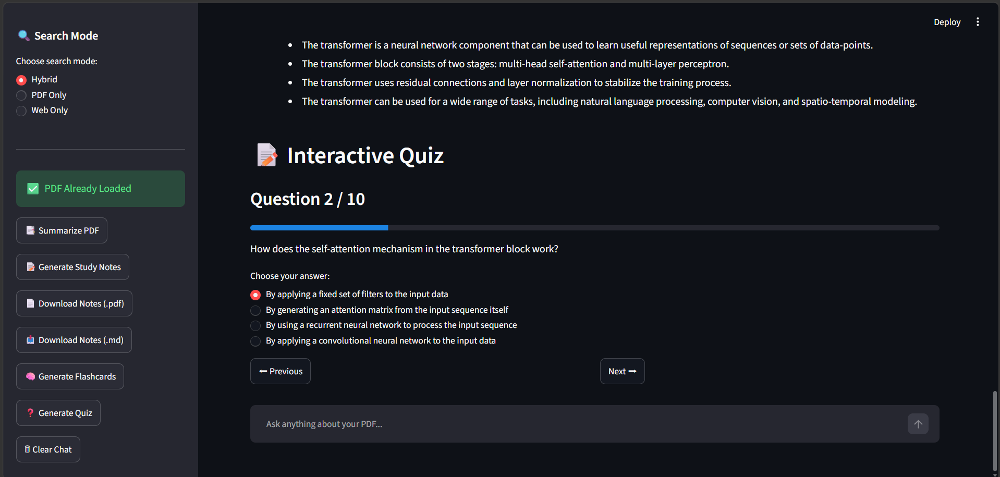
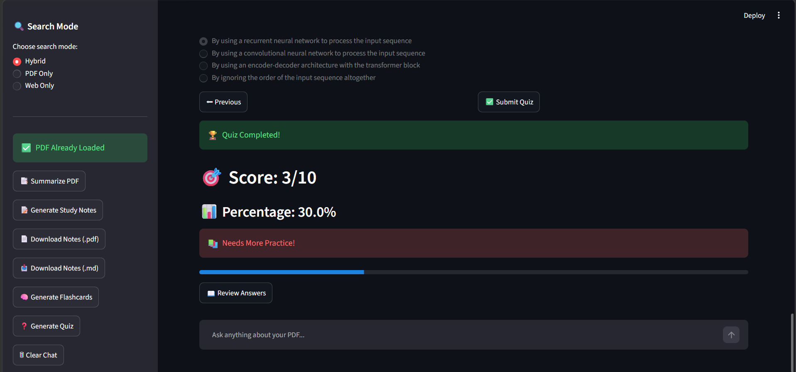
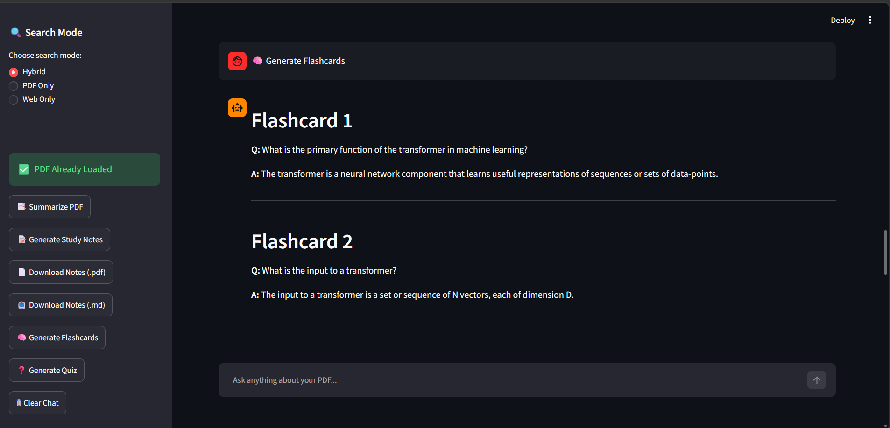

# 📚 AI Research Assistant

Upload a PDF or DOCX and work through it the way you would with a research
partner — ask questions, pull page-grounded citations, generate study notes,
flashcards, and quizzes, with an automatic fallback to the web when your
document doesn't have the answer.

Built with **Streamlit**, **Groq** (LLM inference), **FAISS** (vector search),
and **Sentence-Transformers** (embeddings).

## ✨ Features

| | |
|---|---|
| 📄 **Chat with your document** | Ask questions and get answers grounded in the exact page they came from |
| 🌐 **Hybrid web fallback** | When the document doesn't have it, the assistant searches the web automatically (via Tavily) |
| 📝 **Study notes** | Turn any document into structured, exam-ready notes (Concise / Detailed / Exam-focused) |
| 🧠 **Flashcards** | Auto-generated Q&A flashcards for quick review |
| ❓ **Interactive quiz** | Multiple-choice questions with scoring, timers, flagging, and review mode |
| 🌍 **Multilingual** | Ask in Hindi, Marathi, Tamil, and more — it answers in kind |
| 🔍 **OCR support** | Scanned/image-based PDF pages are OCR'd automatically |
| 📤 **Export** | Export generated notes to PDF |

## 🖼️ Screenshots

| Home | Chat / Summary |
|---|---|
|  |  |

| Notes | Quiz |
|---|---|
|  |  |

| Quiz Result | Flashcards |
|---|---|
|  |  |

## 🏗️ Tech Stack

- **Frontend / App framework:** [Streamlit](https://streamlit.io/)
- **LLM inference:** [Groq](https://groq.com/) (with multi-key fallback and model fallback chain)
- **Embeddings:** `sentence-transformers` (default: `paraphrase-multilingual-MiniLM-L12-v2`)
- **Vector search:** FAISS (`faiss-cpu`)
- **Web search fallback:** [Tavily](https://tavily.com/)
- **Document parsing:** PyMuPDF (PDF), `python-docx` (DOCX)
- **OCR:** EasyOCR
- **PDF export:** ReportLab

## 📂 Project Structure

```
AI_Research_Assistant/
├── app.py                    # Main Streamlit entry point
├── components/
│   ├── chat.py                # Chat rendering + source cards
│   ├── sidebar.py              # Upload, settings, document cache
│   ├── quiz.py / quiz_setup.py         # Interactive quiz UI
│   ├── flashcards.py / flashcard_setup.py  # Flashcard deck UI
│   └── notes_setup.py          # Study notes configuration modal
├── utils/
│   ├── llm.py                  # Groq calls, prompt logic, question rewriting
│   ├── embedding.py             # Sentence-transformers model loading
│   ├── retriever.py             # Chunk retrieval logic
│   ├── vector_store.py          # FAISS vector store
│   ├── chunker.py               # Document chunking
│   ├── pdf_loader.py / docx_loader.py  # Document parsing
│   ├── ocr.py                   # OCR for scanned pages
│   ├── web_search.py            # Tavily web search fallback
│   ├── pdf_export.py            # Export notes to PDF
│   ├── language_detector.py     # Multilingual detection
│   ├── concurrency.py           # CPU job slot limiting
│   └── theme.py                 # Custom CSS, hero section, feature grid
├── assets/                    # Screenshots used in this README
├── requirements.txt
├── packages.txt                # System-level packages (for OCR etc.)
└── env.example                 # Template for local .env
```

## 🚀 Getting Started

### Prerequisites

- Python 3.10+
- A [Groq API key](https://console.groq.com/)
- A [Tavily API key](https://tavily.com/) (for web search fallback)

### Local Development

```bash
git clone https://github.com/Neeraj-kumar14/AI_Research_Assistant.git
cd AI_Research_Assistant

pip install -r requirements.txt

cp env.example .env   # fill in your real keys, keep this file untracked
streamlit run app.py
```

The app will be available at `http://localhost:8501`.

## 🔑 Configuration

### Required secrets

Set these as environment variables (locally via `.env`, or on Hugging Face
Spaces under **Settings → Variables and secrets → New secret**). Secrets are
picked up automatically via `os.getenv(...)` — no code changes needed.

| Variable | Required | Notes |
|---|---|---|
| `GROQ_API_KEY` | ✅ Yes | Primary Groq key |
| `GROQ_API_KEY_2` | No | Extra fallback key (separate quota) |
| `GROQ_API_KEY_3` | No | Extra fallback key |
| `GROQ_API_KEY_4` | No | Extra fallback key |
| `TAVILY_API_KEY` | ✅ Yes | Powers the web search fallback |

> ⚠️ **Never commit real keys.** `.env` is already git-ignored — always copy
> `env.example` to `.env` and fill it in locally.

### Optional tuning

These all ship with working defaults — only override if you need to raise
or lower limits for your hosting tier:

| Variable | Default | Purpose |
|---|---|---|
| `MAX_PDF_PAGES` | 300 | Cap on pages processed per PDF upload |
| `MAX_OCR_PAGES` | 30 | Cap on scanned pages OCR'd per PDF upload |
| `MAX_DOCX_CHARS` | 600000 | Cap on characters processed per DOCX |
| `SESSION_IDLE_TIMEOUT_SECONDS` | 1800 | Idle time before a session's loaded doc is evicted from memory |
| `CACHE_TTL_SECONDS` | 604800 | Max age of a cached processed document (7 days) |
| `MAX_CACHE_BYTES` | 524288000 | Max total size of the on-disk document cache (500MB) |
| `CPU_JOB_SLOTS` | 2 | Max concurrent embedding/OCR jobs across all users |
| `EMBEDDING_MODEL` | `paraphrase-multilingual-MiniLM-L12-v2` | Sentence-transformers model |
| `GROQ_MODEL_FALLBACKS` | see `utils/llm.py` | Comma-separated Groq model fallback chain |

## 🧭 Usage

1. Upload a PDF or DOCX from the sidebar.
2. Once processed, ask questions in the chat box — answers cite the exact
   source page, and fall back to a web search if the document doesn't
   contain the answer (in **Hybrid** mode).
3. Use the sidebar to generate **study notes**, **flashcards**, or a
   **quiz** from the loaded document.
4. Export generated notes to PDF when you're done.

## 📝 Notes on Deployment

- Runs **CPU-only** — `torch` is installed from the CPU wheel index in
  `requirements.txt`, so no GPU is required.
- `.study_cache/` speeds up re-uploads of the same file within a running
  instance, but on most free hosts sits on ephemeral storage and is wiped
  on restart/redeploy — it isn't a permanent store.
- Under heavy concurrent load (many users uploading large/scanned documents
  at once), jobs queue via `CPU_JOB_SLOTS` rather than failing outright —
  expect things to slow down rather than error out.

## 🤝 Contributing

Issues and pull requests are welcome. If you're adding a new document type,
LLM provider, or study tool, try to follow the existing `utils/` +
`components/` split — parsing/logic in `utils/`, Streamlit rendering in
`components/`.

## 📄 License

No license file is currently included in this repository. Add one (e.g. MIT,
Apache 2.0) if you intend for others to reuse this code.
